.. _tutorial_namerun:

Run NAME
==========================

Follow this tutorial to run NAME using all available user-defined options.
First you need to login. Please follow the login instructions in the :ref:`user guide <login>`.

.. contents::
   :local:
   :depth: 2
   :backlinks: none

Select NAME-WPS Process
----------------------

Go to the ``Processes`` tab.

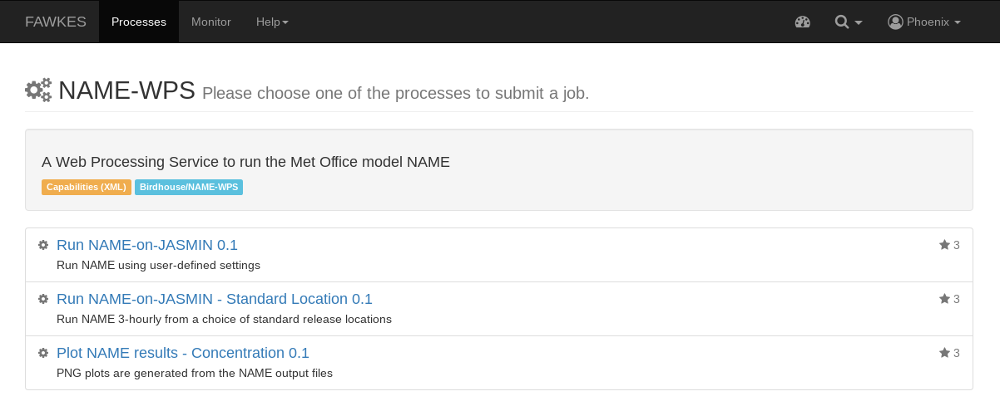

Click on *Run NAME-on-JASMIN* and you will get a form to enter the process parameters.

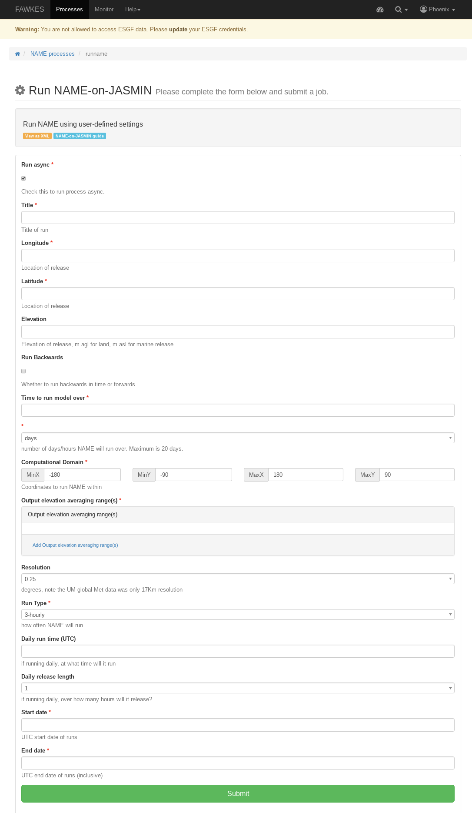

Enter Process Parameters
------------------------

First enter a title for this run. Note, spaces will be converted to underscores.

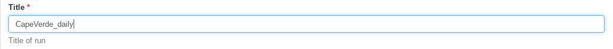

Then select the release location by entering the longitude in decimal degrees. This value cannot exceed +/-180.

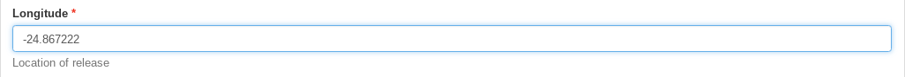

Do the same for the latitude of release, in this case the value cannot exceed +/-90.

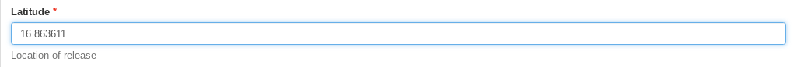

Enter the release elevation in meters.

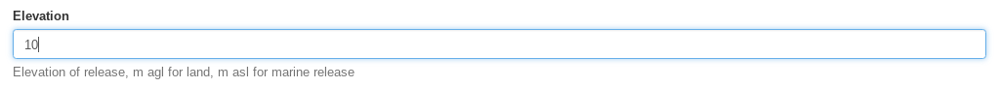

Tick the checkbox if you wish to run NAME backwards from the time of release, or leave it to run NAME forwards.

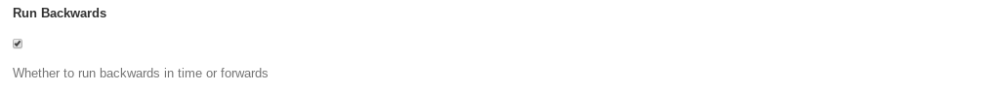

Using the following two boxes select how long you want to run NAME over, in hours or days.
Note, the maximum permitted value is 20 days.

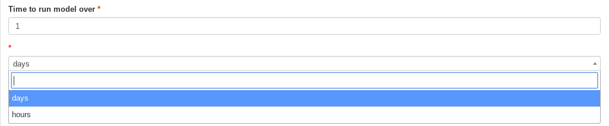

Select the computational domain NAME will calculate the dispersion within. Enter the minimum
and maximum longitude (X) and latitude (Y) values.

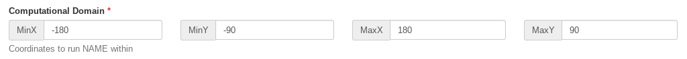

Next, choose the output elevation ranges you which to calculate the particle dispersion within.
Multiple values can be added by continuing to click on the blue link. Note that values entered here must be two numbers
separated by a dash.

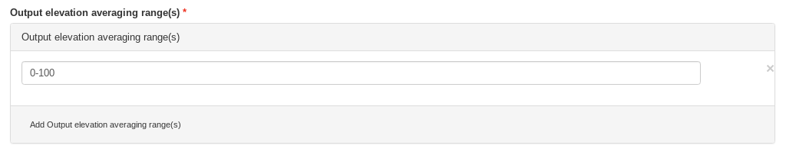

Use the dropdown box to select the resolution to run NAME within. The options are 0.05 or 0.25 degrees. Note that we don't
recommend using 0.05 degrees for runs longer than 5 days.

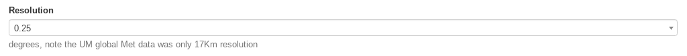

Select how often you want the simulated particles released each day, either daily (i.e. once) or 3-hourly (8 times).

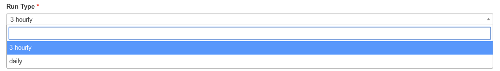

If you selected daily above, you can then choose at what time you want the particles released and how long for.

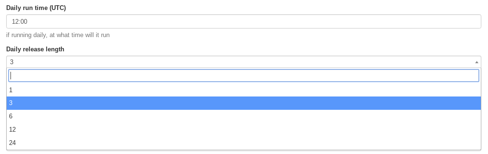

Finally, enter the start and end dates that you'd like NAME to run within. Note, these are inclusive and as with all NAME
time parameters are considered within the Coordinated Universal Time (UTC) and not any local timezone.

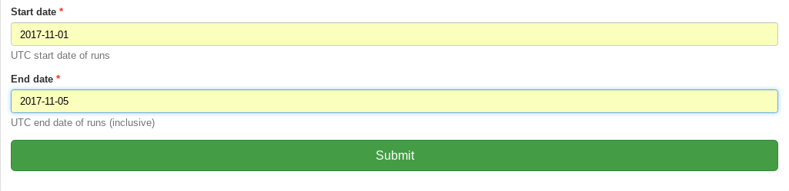

After choosing all the above options, click ``submit`` to run this job on JASMIN.

Monitor running Job
-------------------

The job is now submitted and can be monitored on the *Monitor* page:

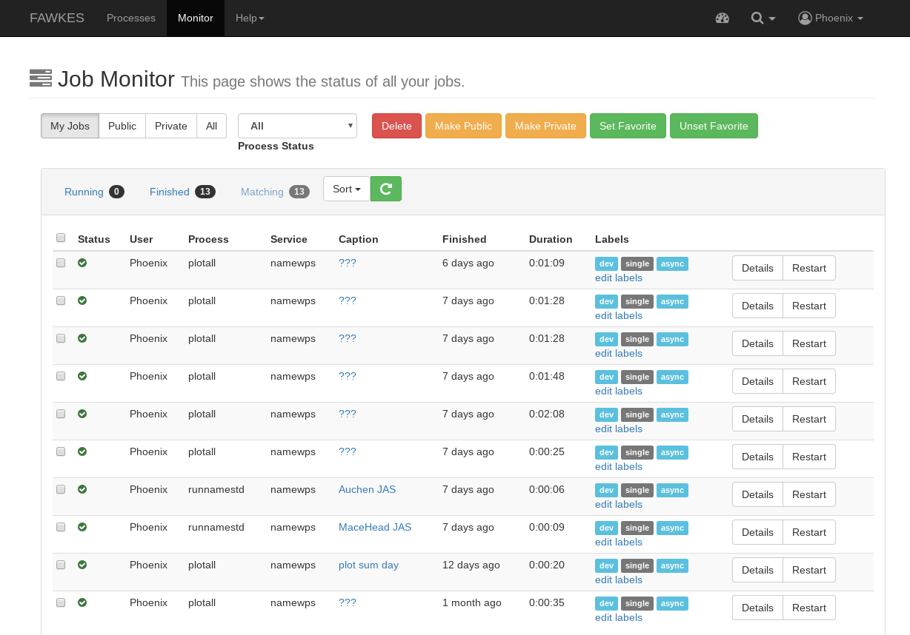

Click on the green refresh icon to check the status of the job.

Display the outputs
-------------------

Click on the details link to see a running log of the job process.

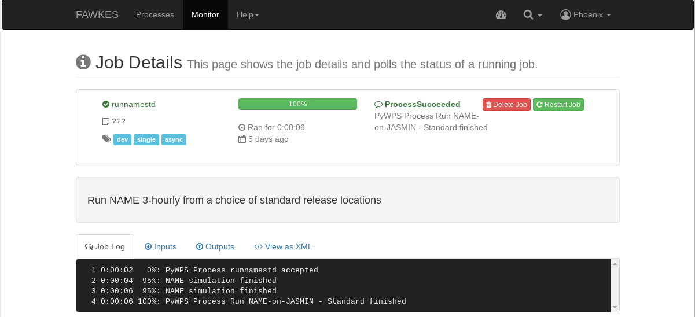

Click on the *Outputs* tab to show the run outputs - a job ID, zipped folder and an example plot.

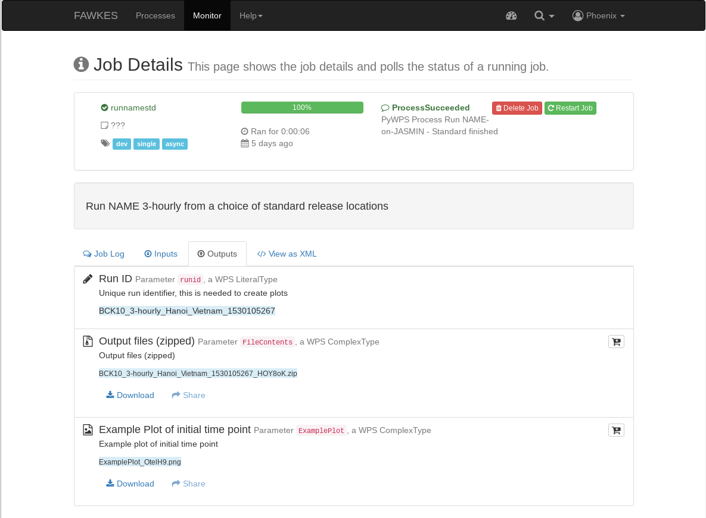

