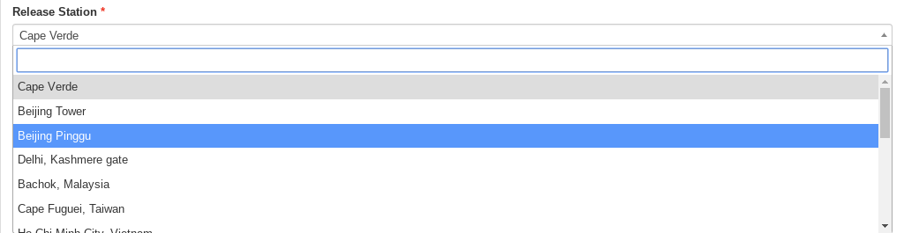
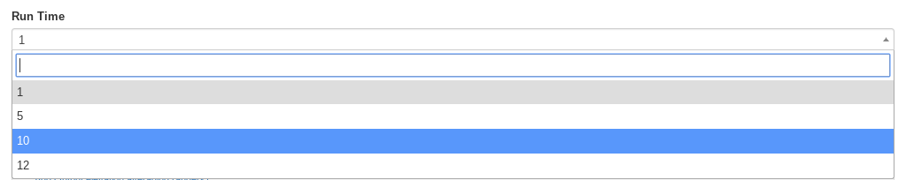
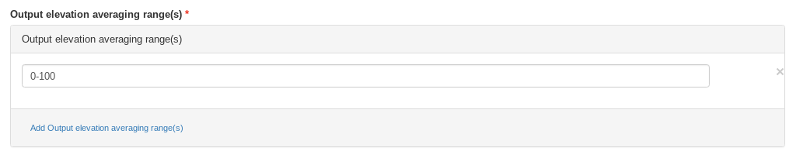
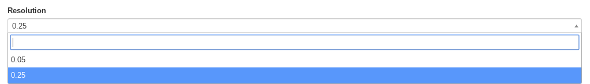
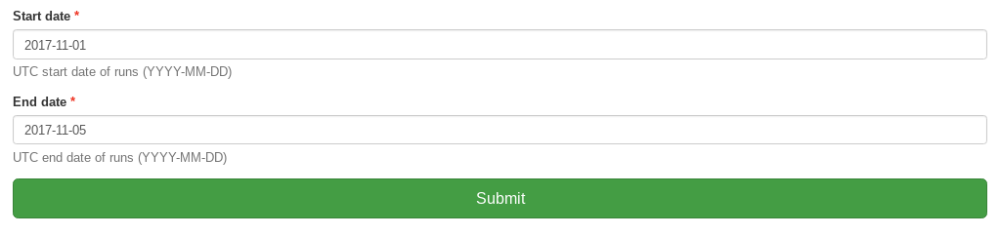

.. _tutorial_namerun:

Run NAME
==========================

Follow this tutorial to run NAME using all available user-defined options.
First you need to login. Please follow the login instructions in the :ref:`user guide <login>`.

.. contents::
   :local:
   :depth: 2
   :backlinks: none

Select NAME-WPS Process
----------------------

Go to the ``Processes`` tab.

.. image:: ../_images/tutorial/Processes.png

Enter Process Parameters
------------------------

Click on *Run NAME-on-JASMIN* and you will get a form to enter the process parameters:

First choose the release location from the dropdown list of options. This defines the latitude, longitude and elevation
of the particle release, as well as the computational domain.

Tick the checkbox if you wish to run NAME backwards from the time of release, or leave it to run NAME forwards.

From the dropdown box, select how many days you which to run NAME over. For the standard release sites the options are 1, 5, 10 and 12 days.

Next, choose the output elevation ranges you which to calculate the particle dispersion within.
Multiple values can be added by continuing to click on the blue link. Note that values entered here must be two numbers
separated by a dash.

Use the dropdown box to select the resolution to run NAME within. The options are 0.05 or 0.25 degrees. Note that we don't
recommend using 0.05 degrees for runs longer than 5 days.

Finally, enter the start and end dates that you'd like NAME to run within. Note, these are inclusive and as with all NAME
time parameters are considered within the Coordinated Universal Time (UTC) and not any local timezone.

After choosing all the above options, click ``submit`` to run this job on JASMIN.

Monitor running Job
-------------------

The job is now submitted and can be monitored on the *Monitor* page:

.. image:: ../_images/tutorial/fawkes_monitor.png

Click on the green refresh icon to check the status of the job.

Display the outputs
-------------------

Click on the details link to see a running log of the job process.

.. image:: ../_images/tutorial/fawkes_std_log.png

Click on the *Outputs* tab to show the run outputs - a job ID, zipped folder and an example plot.

.. image:: ../_images/tutorial/fawkes_std_outputs.png

