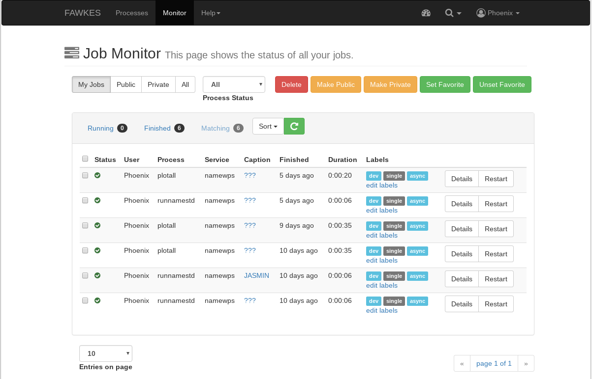
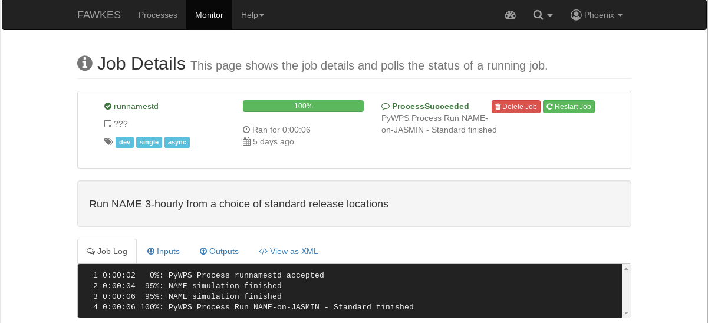

.. _tutorial_namestd:

Run NAME - Standard
==========================

First you need to login. Please follow the login instructions in the :ref:`user guide <login>`.

.. contents::
   :local:
   :depth: 2
   :backlinks: none

Select NAME-WPS Process
----------------------

Go to the ``Processes`` tab.

.. image:: ../_images/tutorial/fawkes_processes.png

Enter Process Parameters
------------------------

Click on *Run NAME-on-JASMIN - Standard* and you will get a form to enter the process parameters:

Select the release station and running options then click ``submit``.

Monitor running Job
-------------------

The job is now submitted and can be monitored on the *Monitor* page:

Click on the green refresh icon to check the status of the job.

Display the outputs
-------------------

Click on the details link to see a running log of the job process.

Click on the *Outputs* tab to show the run outputs - a job ID, zipped folder and an example plot.

.. image:: ../_images/tutorial/fawkes_std_outputs.png

