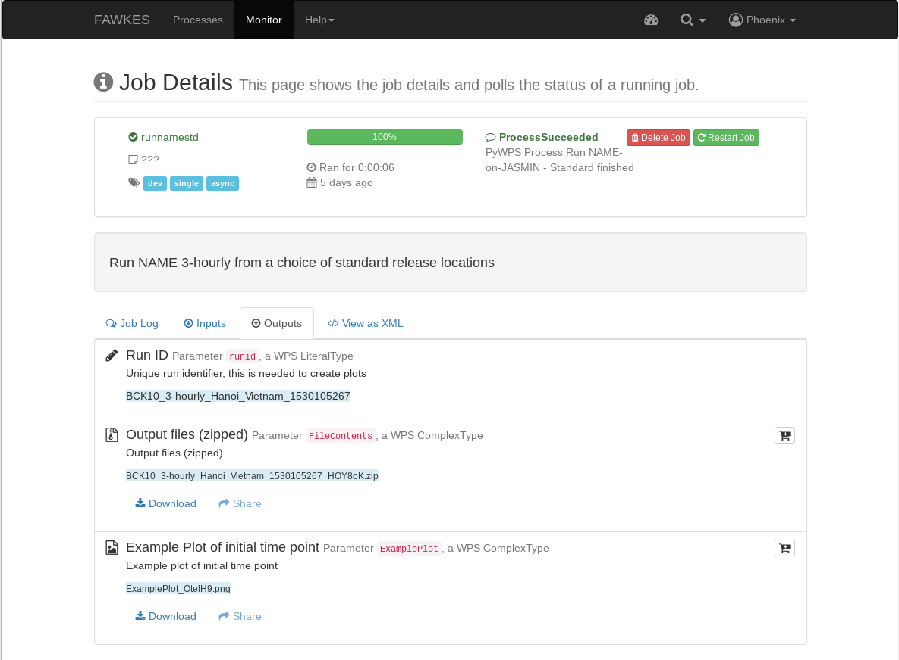

.. _tutorial_namestd:

Run NAME - Standard
==========================

First you need to login. Please follow the login instructions in the :ref:`user guide <login>`.

.. contents::
   :local:
   :depth: 2
   :backlinks: none

Select NAME-WPS Process
----------------------

Go to the ``Processes`` tab.

Enter Process Parameters
------------------------

Click on *Run NAME-on-JASMIN - Standard* and you will get a form to enter the process parameters:

.. image:: ../_images/tutorial/fawkes_runnamestd.png

Select the release station and running options then click ``submit``. All options are explained below:

===================================  =========  ==========  ========
Option                               Box Type   Default     Detail
===================================  =========  ==========  ========
Release station                      Selection  Cape Verde  Site of release
Run backwards                        Tick-box   False       Whether to run NAME forwards or backwards in time
Run time                             Selection  1           Number of days to run NAME across (choice of 1, 5, 10 and 12)
Output elevation averaging range(s)  Text       0-100       Output elevation ranges to use (must be separated by a '-')
Resolution                           Selection  0.25        Degrees of resolution (choice of 0.25 or 0.05)
Start date                           Text       -           Start date that NAME will run on
End date                             Text       -           End date that NAME will run to (inclusive)
===================================  =========  ==========  ========

Monitor running Job
-------------------

The job is now submitted and can be monitored on the *Monitor* page:

.. image:: ../_images/tutorial/fawkes_monitor.png

Click on the green refresh icon to check the status of the job.

Display the outputs
-------------------

Click on the details link to see a running log of the job process.

.. image:: ../_images/tutorial/fawkes_std_log.png

Click on the *Outputs* tab to show the run outputs - a job ID, zipped folder and an example plot.

