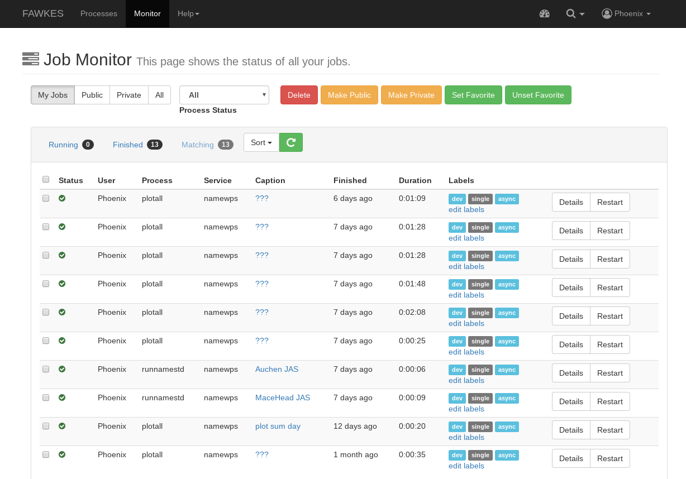
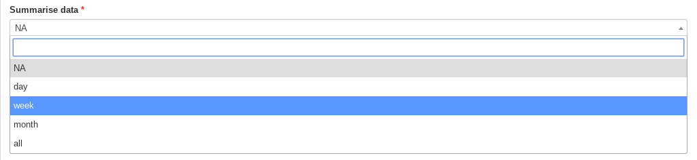

.. _tutorial_plotconc:

Plot NAME results
==========================

Follow this tutorial to plot the outputs from a previous NAME run.
First you need to login. Please follow the login instructions in the :ref:`user guide <login>`.

.. contents::
   :local:
   :depth: 2
   :backlinks: none

Select NAME-WPS Plotting Process
----------------------

Go to the ``Processes`` tab.

.. image:: ../_images/tutorial/Processes.png

Click on *Plot NAME results - Concentration* and you will get a form to enter the process parameters.

Enter the NAME Run ID to Plot
-----------------------------

The only required parameter to generate plots is the NAME run ID. This must be an ID that was generated by FAWKES from
a previous NAME-WPS process. To find the run ID, navigate to the ``Monitor`` tab and find the run you wish to plot.

The run ID is located within the outputs of each NAME run. Copy this value.

You can then paste this value into the Plot process run ID field.

If you already know the run ID that you wish to plot, enter it into the text box.

Should you press submit now, you will generate a plot for each time-point and output elevation within that run.

Enter Optional Parameters
------------------------

After entering the NAME run ID, there are a number of optional parameters that will change how the data is plotted.

You can summarise the data by selecting a value in the first dropdown box.
This will add the particle concentration values for each day, week or month.
The `all` option summarises all the data within this NAME run into a single plot.

Instead of summarising the data, you could select one particular time-point to plot by entering a date and time into the following field.
Note that if anything is entered into this box any summary selection will be ignored.

You can optionally mark the release site onto the plots by ticking the checkbox.

It is also possible to change the projection from the default of `cyl`, to either `npstere` or `spstere`.

The plot area can be changed by selecting the minimum and maximum longitude and latitude boundaries.

The scale of the particle concentration can be changed by entering a minimum and maximum value. If left empty each plot
will autoscale based on the containing data.

Finally, the colour scheme used can be changed from `coolwarm` to either `viridis` or `rainbow`. Note we do not recommend using
rainbow as it is not colour-blind friendly.

After altering any or none of these optional parameters, the plots can be created by pressing submit.

Monitor running Job
-------------------

The job is now submitted and can be monitored on the *Monitor* page:

Click on the green refresh icon to check the status of the job. You can also click on `Details` to see a running job log.

Display the outputs
-------------------

From the `Details` page, click on the *Outputs* tab to show the run outputs. In this case we have generated multiple graphs
so the results are contained within a zipped folder.

This folder can be downloaded and unzipped to view the plot files.

Each file is a PNG plot of the data, modified according to your input options. In this tutorial we created a plot per time-point (summarise='NA')
and marked the release location.

